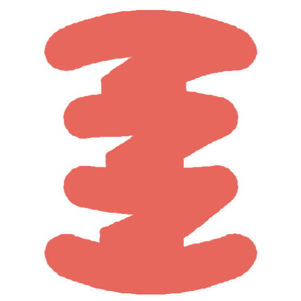

<br>
# Simple Spring
<i>Simple numeric spring physics. Springs a value from a start to a target with velocity inheritance.</i> <br>
### Version 1.1.1.0

[](https://github.com/SalmanShhh/C3Addon-simple_spring/releases/download/salmanshh_simple_spring-1.1.1.0.c3addon/salmanshh_simple_spring-1.1.1.0.c3addon)
<br>
<sub> [See all releases](https://github.com/SalmanShhh/C3Addon-simple_spring/releases) </sub> <br>

#### What's New in 1.1.1.0
**Fixed:**
fix issue correctly fetching instance deltatime

<sub>[View full changelog](#changelog)</sub>

---
<b><u>Author:</u></b> SalmanShh <br>
<sub>Made using [CAW](https://marketplace.visualstudio.com/items?itemName=skymen.caw) </sub><br>

## Table of Contents
- [Usage](#usage)
- [Examples Files](#examples-files)
- [Properties](#properties)
- [Actions](#actions)
- [Conditions](#conditions)
- [Expressions](#expressions)
---
## Usage
To build the addon, run the following commands:

```
npm i
npm run build
```

To run the dev server, run

```
npm i
npm run dev
```

## Examples Files

---
## Properties
| Property Name | Description | Type |
| --- | --- | --- |
| Stiffness | How quickly spring responds, Increase stiffness for faster response. | float |
| Damping | How much oscillation is dampened (0-1), Increase damping to reduce overshoot. | float |
| Precision | Threshold to consider animation complete. Lower values require closer proximity to target. | float |


---
## Actions
| Action | Description | Params
| --- | --- | --- |
| Add to velocity | Add a value to the spring's current velocity. | Value             *(number)* <br> |
| Set damping | Set spring damping (0-1). Higher = less oscillation. | Damping             *(number)* <br> |
| Set stiffness | Set spring stiffness (0-1). Higher = faster response. | Stiffness             *(number)* <br> |
| Set velocity | Set the spring's current velocity. | Velocity             *(number)* <br> |
| Snap to target | Instantly jump to the target value. |  |
| Spring from/to | Spring numeric value from start to target. Inherits velocity if already animating. | From             *(number)* <br>To             *(number)* <br> |
| Spring from/to angle | Spring angle value from start to target. Handles angle wrapping to take shortest path. | From             *(number)* <br>To             *(number)* <br> |
| Stop | Stop the spring animation at current value. |  |


---
## Conditions
| Condition | Description | Params
| --- | --- | --- |
| Has reached target | True if the spring has reached its target. |  |
| Is animating | True if the spring is currently animating. |  |
| On reached target | Triggered when the spring reaches its target. |  |


---
## Expressions
| Expression | Description | Return Type | Params
| --- | --- | --- | --- |
| Damping | Get the current damping. | number |  | 
| From | Get the from (start) value. | number |  | 
| Stiffness | Get the current stiffness. | number |  | 
| To | Get the to (target) value. | number |  | 
| Value | Get the current spring value. | number |  | 
| Velocity | Get the current velocity. | number |  | 


---
## Changelog

### Version 1.1.1.0

**Fixed:**
fix issue correctly fetching instance deltatime
---

### Version 1.1.0.0

**Changed:**
Rewrote the spring physics logic in instance.js to use fixed-step updates for framerate independence and smoother interpolation. Simplified and renamed internal state variables, improved angle handling, and consolidated finishing/reset logic. 

---

### Version 1.0.0.0

**Added:**
initial release, fix version ID

---

### Version 0.0.0.0

**Added:**
Initial release.

---
